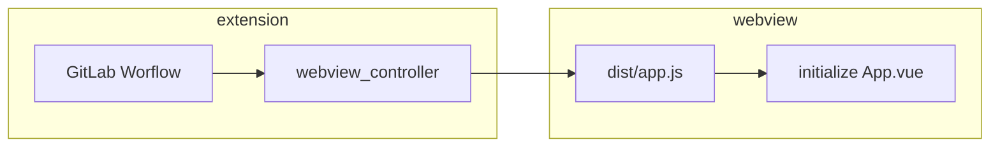

# Extension architecture

This document gives you a high-level overview of the main components of the extension. It helps you place your contribution in the right place in the codebase. This document describes the architecture as-is, but it also contains checkboxes for aspirations or refactoring in progress.

## What does the extension do?

The extension is providing a "glue" layer between the [VS Code Extension API](https://code.visualstudio.com/api/references/vscode-api) and the GitLab instance API ([REST](https://docs.gitlab.com/ee/api/api_resources.html), [GraphQL](https://docs.gitlab.com/ee/api/graphql/)). The extension code aims to connect VS Code editor with GitLab functionality as efficiently as possible. The less code and abstractions, the better.

## The key concepts

- GitLab project is represented by a Git remote URL in local repository.
- To access GitLab API, you need an access token for that instance.
- After you know the GitLab project URL and you have an access token, you can fetch the project from API.

These three points result in the most important interface in the whole extension:

```ts
export interface ProjectInRepository {
  pointer: GitRemoteUrlPointer;
  account: Account;
  project: GitLabProject;
}
```

This interface is the only information we need for most extension commands and operations.

### Git integration

Our extension builds on top of the built-in [VS Code Git extension](https://github.com/microsoft/vscode/tree/main/extensions/git). Our extension listens on changes in the VS Code Git. Every time a repository is added or removed, we run extension initialization and try to find all GitLab projects in available repositories. This means our extension is always in sync with the [VS Code version control view](https://code.visualstudio.com/docs/editor/versioncontrol).

The main class that interacts with the VS Code Git is [`GitExtensionWrapper`](../../src/git/git_extension_wrapper.ts). [`GitLabProjectRepository`](../../src/gitlab/gitlab_project_repository.ts) then listens on Git repository changes and initializes instances of `ProjectInRepository`.

### GitLab integration

We use [`gitlab_service.ts`](../../src/gitlab/gitlab_service.ts) for all calls to the GitLab API. We try to use predominantly [GraphQL](https://docs.gitlab.com/ee/api/graphql/), but some features are not available in GraphQL, and then we use `cross-fetch` to connect to the [REST](https://docs.gitlab.com/ee/api/api_resources.html) API.

In most cases, the `GitLabService` is wrapped in `RefreshingGitLabService`, which checks that the OAuth token is valid before making an API call. If the token isn't valid, it refreshes the token.

When you want to obtain an instance of the `GitLabService`, use the `getGitLabService: (p: ProjectInRepository)` method.

## Building blocks of the extension

### Tree view (`src/tree_view`)

[TreeView](https://code.visualstudio.com/api/extension-capabilities/extending-workbench#tree-view), is the left-hand-side panel where we show issues and merge requests. Every VS Code extension can contribute a TreeView.

### Commands (`src/commands`)

[Commands](https://code.visualstudio.com/api/extension-guides/command) are functions that can be invoked either by the user (usually from [command palette](https://code.visualstudio.com/docs/getstarted/userinterface#_command-palette)) or programmatically. Example commands in this extension would be: **Insert Snippet**, **Refresh Sidebar**, and **Copy Link to Active File on GitLab**.

Commands are of two types:

- Commands that run on GitLab project (such as **Create Snippet**, **Open Current Project on GitLab**). These commands implement the [`ProjectCommand`](../../src/commands/run_with_valid_project.ts) interface.
- Commands that don't need a project (such as **Add Account to VS Code**, **Show Extension Logs**). These commands are functions with no arguments.

### Status bar (`src/status_bar.js`)

The status bar is the last row at the bottom of the editor. We add multiple [Status Bar Items](https://code.visualstudio.com/api/extension-capabilities/extending-workbench#status-bar-item) to it to show pipeline status, open MR and closing Issue for the current branch.

We periodically check for changes (every 30 seconds). [`CurrentBranchRefresher`](../../src/current_branch_refresher.ts) is responsible for refreshing the information. [`StatusBar`](../../src/status_bar.ts) is then responsible for adding the items to the status bar.

### Webview (`src/webview/`)

[Webview](https://code.visualstudio.com/api/extension-guides/webview) is an API that allows extensions to show a custom web page into an editor tab.

We use Webview to show merge request and issue details. We use a separate NPM module with its tests and build system (`webpack`, `babel`). This NPM module contains a Vue app that is compiled into dist `js` files. `src/webview_controller.js` is placed in the extension project, and initializes the whole Webview.



To further understand how the extension communicates with Webview, read the [Webview extension guide](https://code.visualstudio.com/api/extension-guides/webview).

### Accounts (`src/accounts/account_service.ts`)

We authenticate to GitLab API using [personal access tokens](https://docs.gitlab.com/ee/api/README.html#personalproject-access-tokens) or [OAuth](https://docs.gitlab.com/ee/integration/oauth_provider.html). The main interface is the [`Account`](../../src/accounts/account.ts) and we store them using the [`AccountService`](../../src/accounts/account_service.ts).

OAuth accounts are more complex than Token accounts. We create them using the [`GitLabAuthenticationProvider`](../../src/accounts/oauth/gitlab_authentication_provider.ts). Then we refresh them when they expired using the [`TokenExchangeService`](../../src/gitlab/token_exchange_service.ts).

---

Introducing this document was motivated by a blog article from Aleksey Kladov: [ARCHITECTURE.md](https://matklad.github.io//2021/02/06/ARCHITECTURE.md.html).
