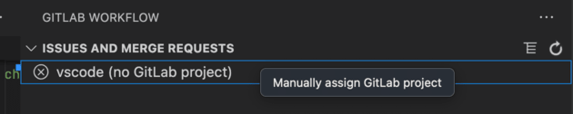

# Known issues

## HTTPS project cloning works but SSH cloning fails

This problem often happens when your SSH URL host or path is different from your HTTPS path. The extension uses:

- The host to match the account that you set up.
- The path to get the namespace and project name.

For example, this project's URL's are:

- `git@gitlab.com:gitlab-org/gitlab-vscode-extension.git`
- `https://gitlab.com/gitlab-org/gitlab-vscode-extension.git`

Both have the `gitlab.com` and `gitlab-org/gitlab-vscode-extension` path.

Check if your SSH URL is on a different host, or if it has extra segments in a path.

### Workaround

To assign any Git repository to any GitLab project, manually assign a GitLab project to this repository by right-clicking the failed project in the sidebar:

### Open issues

- [Simplify matching GitLab projects with git remotes](https://gitlab.com/gitlab-org/gitlab-vscode-extension/-/issues/577)

## I have a trouble setting up an account on Ubuntu

Please see [this existing issue](https://gitlab.com/gitlab-org/gitlab-vscode-extension/-/issues/580).
